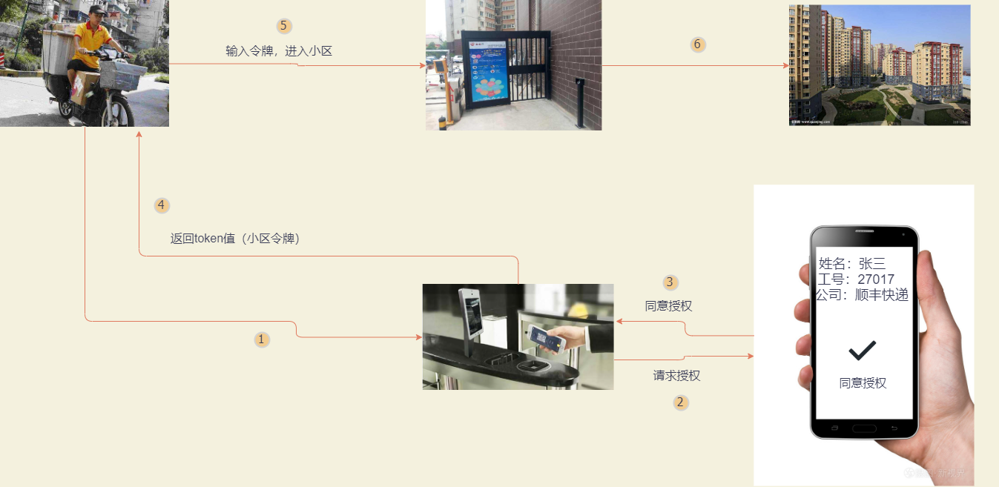

### 认识 OAuth2.0

[阮一峰 oauth2](https://www.ruanyifeng.com/blog/2019/04/oauth_design.html)

#### 什么是 OAuth？

> [OAuth](http://en.wikipedia.org/wiki/OAuth)是一个关于授权（authorization）的开放网络标准协议，简单理解就是一种授权机制。
>
> 它是在客户端和资源所有者之间的授权层，用来分离两种不同的角色。在资源所有者同意并向客户端颁发令牌后，客户端携带令牌可以访问资源所有者的资源。
>
> OAuth2.0 是 OAuth 协议的一个版本，**2.0 版本不兼容 1.0 版本，相当于 1.0 版本已经废弃**

**测试三方登录：**

https://www.zhihu.com/

---

#### 授权机制设计

**生活场景**

1. 第一步，门禁系统的密码输入器下面，增加一个按钮，叫做"获取授权"。快递员需要首先按这个按钮，去申请授权。

2. 第二步，他按下按钮以后，屋主（也就是我）的手机就会跳出对话框：有人正在要求授权。系统还会显示该快递员的姓名、工号和所属的快递公司。

3. 我确认请求属实，就点击按钮，告诉门禁系统，我同意给予他进入小区的授权。

4. 第三步，门禁系统得到我的确认以后，向快递员显示一个进入小区的令牌（access token）。令牌就是类似密码的一串数字，只在短期内（比如七天）有效。

5. 第四步，快递员向门禁系统输入令牌，进入小区

**互联网场景**

首先，居民小区就是储存用户数据的网络服务。比如，微信储存了我的好友信息，获取这些信息，就必须经过微信的"门禁系统"。

其次，快递员（或者说快递公司）就是第三方应用，想要穿过门禁系统，进入小区,在这里可以理解知乎。

我就是用户本人，同意授权第三方应用进入小区，获取我的数据（自己的微信账号信息）。

> **OAuth 就是一种授权机制。数据的所有者告诉系统，同意授权第三方应用进入系统，获取这些数据。系统从而产生一个短期的进入令牌（token），用来代替密码，供第三方应用使用**

---

#### 令牌的特点

（1）短期的，到期会自动失效，用户自己无法修改。

（2）可以被数据所有者撤销，会立即失效。

（3）有权限范围（scope），对于网络服务来说，只读令牌就比读写令牌更安全。

> 令牌既可以让第三方应用获得权限，同时又随时可控，不会危及系统安全。这也是 OAuth 2.0 的优点。
>
> **注意**，只要知道了令牌，就能进入系统。系统一般不会再次确认身份，所以**令牌必须保密，泄漏令牌与泄漏密码的后果是一样的。** 这也是为什么令牌的有效期，一般都设置得很短的原因。

---
