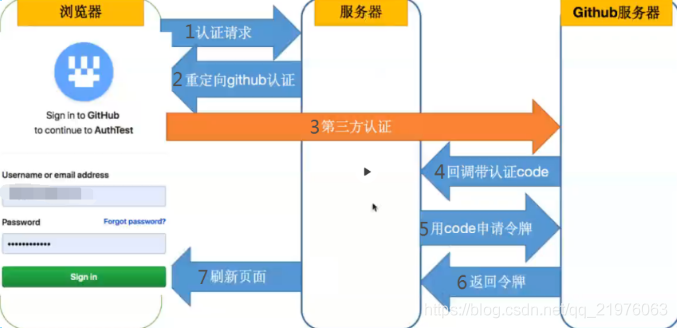

### GitHub授权登录

#### 实现原理

> 所谓第三方登录，实质就是 OAuth 授权。用户想要登录 github网站，github网站让用户提供第三方网站的数据，证明自己的身份。获取第三方网站的身份数据，就需要 OAuth 授权。

1. A 网站让用户跳转到 GitHub （发起一个认证的请求）
2. 将这个认证请求重定向到github网站
3. GitHub 要求用户登录，然后询问"A 网站要求获得 xx 权限，你是否同意？"
4. 用户同意，GitHub 就会重定向回 A 网站，同时发回一个授权码。
5. A 网站使用授权码，向 GitHub 请求令牌。
6. GitHub 返回令牌.
7. A 网站使用令牌，向 GitHub 请求用户数据。

---

#### 实现流程

#### 创建应用

> 本地创建应用服务

##### 应用登记

1. **GitHub服务器配置**   [跳转GitHub](https://github.com/)
2. setting => developer settings =>  OAuth Apps =>  应用信息填写 => generate a new client secret

3. 登记完成之后，获取到 生成Client ID和Client Secret，这就是应用的身份识别码。

代码实现

1. 前端进行登录地址创建
2. 后端进行授权码地址重定向
3. 路由匹配github返回地址
4. 获取授权码code，进行令牌请求
5. 获取令牌请求数据，进行界面渲染

#### github 跳转地址相关

| url                                         | 请求方法 | 请求参数                                                     | 说明             |
| ------------------------------------------- | -------- | ------------------------------------------------------------ | ---------------- |
| https://github.com/login/oauth/authorize    | GET      | client_id：string   // 应用唯一标识                          | 授权码获取地址   |
| https://github.com/login/oauth/access_token | POST     | client_id:string   // 用户唯一标识 client_secret   // 用户申请密钥 code     // 授权码 | 令牌 获取地址    |
| https://api.github.com/user                 | get      | 请求头添加{headers:Authorization:令牌}                       | 用户信息获取地址 |

